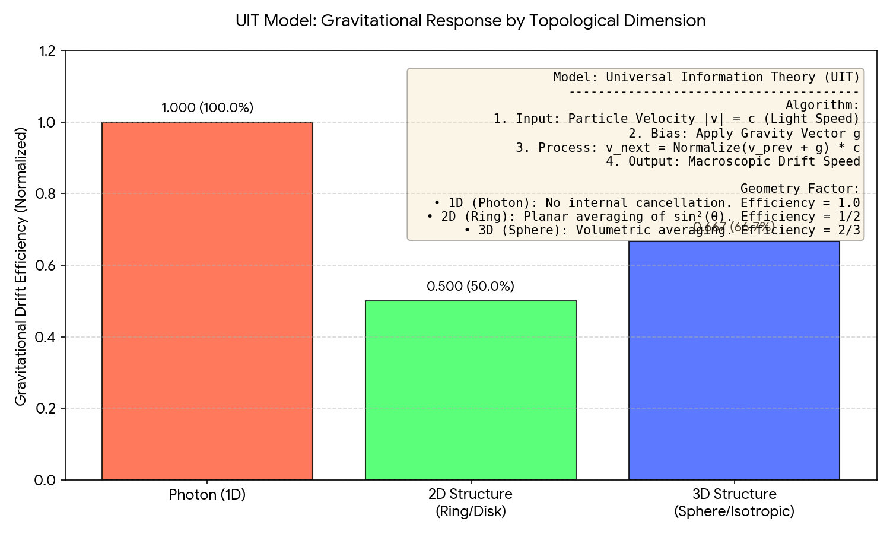

# Computrium: The Universe Information Theory (UIT) Engine

[](https://opensource.org/licenses/Apache-2.0)
[]()
[]()
[](https://doi.org/10.5281/zenodo.18135945)

> **"Nature is Hardware. Physics is Source."**
> **"自然即硬件，物理即源码。"**

---

# Universe Information Theory


## 🌌 Visual Proof of Concept: Gravitational Lensing
The image above is a real-time rendering output from the Universe Information Theory core addressing field. 

**Key Technical Breakthroughs Demonstrated:**
* **Zero Collision Detection**: Unlike traditional Ray-Tracing (NVIDIA RTX), our photons follow signal-addressing fields.
* **O(1) Complexity**: Rendering cost is independent of geometry; it scales only with field density.
* **Mass-Bandwidth Equivalence**: The "Black Hole" effect is a natural emergent property of high-bandwidth occupancy in the UIT bus.

---

## 🛡️ Intellectual Property & Patent Status
All architectural logic, including the field-guided addressing and in-situ computing protocols, are strictly protected:
* **Core Architecture**: Patent Pending (filed).
* **Implementation**: Source code remains private during the audit phase.
* **Binary Access**: Compiled demonstration builds will be released in the "Releases" section for verification only.

Unauthorized reverse engineering or re-implementation of the UIT addressing field is a direct violation of global IP laws.

---

## 📑 Executive Summary (项目摘要)

**Computrium** 是一个实验性的物理仿真架构，旨在验证 **宇宙信息论 (Universe Information Theory, UIT)**。

本项目不是基于传统牛顿力学或广义相对论几何计算的仿真引擎，而是提出了一种全新的计算范式：**基于原位去中心化场数据聚合 (In-situ Decentralized Field Data Aggregation)**。该架构通过模拟时空网格的数据传输带宽限制，自然涌现出惯性、引力及相对论效应，旨在解决大规模多体仿真中的算力瓶颈与存储墙问题。

本项目处于早期架构验证阶段 (Pre-Alpha)。核心定义（如 Payload 的具体结构、CarrierSignal 的计算方式）可能会随着仿真数据的反馈而进行重构 (Refactor)。

本仓库目前作为该技术的**核心理论架构公示 (Architecture Disclosure)** 及**现有技术声明 (Prior Art Statement)**。

---

## ⚖️ Intellectual Property & Legal Notice (知识产权与法律声明)

**PATENT PENDING / 专利申请中**

The methodology, hardware architecture, and data structures described herein are currently under examination by the National Intellectual Property Administration (CNIPA).
本文所述的方法论、硬件架构及数据结构目前正处于国家知识产权局的审查程序中。

**Application References (申请索引):**
本项目核心技术（UIT 架构、带宽-质量映射逻辑及原位计算硬件实现）受以下专利家族保护。任何未经授权的商业复现（包括但不限于 ASIC 设计、FPGA 仿真、物理引擎算法）均将面临法律追责。

1.  **Invention Patent Application (发明专利申请):**
    * **Application No.:** [2026100000964]
    * **Subject:** 一种基于原位去中心化场数据聚合的大规模并行仿真方法
    * **Application No.:** [2026100001967]
    * **Subject:** 一种基于原位去中心化场数据聚合的大规模并行仿真方法、处理架构及存储介质
    * **Application No.:** [2026100036788]
    * **Subject:** 一种基于全域离散信号场的分布式场耦合计算系统及方法
2.  **Utility Model Application (实用新型申请):**
    * **Application No.:** [2026200001089]
    * **Subject:** 一种基于原位去中心化场数据聚合的大规模并行仿真处理架构
    * **Application No.:** [2026200001873]
    * **Subject:** 一种基于原位去中心化场数据聚合的大规模并行仿真处理架构及芯片

**Prior Art Declaration:**
This repository serves as a rigid proof of publication. Any unauthorized filing of patents covering the same technical scope after the priority date of the applications listed above will be challenged based on this prior art.
(本仓库作为技术公开的有力证明。任何在此优先权日之后针对相同技术范围的未授权专利申请，都将基于本现有技术面临挑战。)

---

# 有限步骤构造概率论 (Step-Finite Constructive Probability)

**一种基于算法停机性、死锁判定与几何区间的概率学新框架**
**A New Framework for Probability Based on Algorithmic Halting, Deadlock Determination, and Geometric Intervals**

---

## 1. 核心理论体系 (Core Theoretical Framework)

本理论将概率的定义从传统的“测度论”转向“算法构造论”，建立了事件存在性与计算步骤有限性之间的等价关系，并指出概率的本质是非原子事件在状态空间中的**几何区间覆盖**。
This theory shifts the definition of probability from traditional "Measure Theory" to "Algorithmic Constructivism," establishing an equivalence between the existence of an event and the finiteness of computational steps, identifying probability as the **geometric interval coverage** of non-atomic events in state space.

### 1.1 存在性公理 (The Existence Axiom)
* **中文描述**：
    一个事件 $E$ “存在”的充要条件是，生成 $E$ 的算法 $A(E)$ 能够在 $N < \infty$ 的步骤内停机。物理世界中不存在非构造性的实体。
* **English Description**:
    An event $E$ "exists" if and only if the algorithm $A(E)$ generating $E$ halts within $N < \infty$ steps. There are no non-constructive entities in the physical world.

### 1.2 双重死锁公理 (The Dual Deadlock Axiom)
> **Ref**: 

基于系统无法处理无穷的逻辑，定义两种导致概率为 0 的物理非法状态（死锁）：
Based on the system's inability to process infinity, we define two physically illegal states (deadlocks) resulting in zero probability:

* **类型 A：集合无限死锁 (Infinite Set Deadlock)**
    * **描述**：当非原子事件 $P$ 试图从一个包含无穷多元素的集合中选取一个特定事件 $P_i$ 时（即 $P \in \{P_1, ... P_n \mid n=\infty\}$），由于集合中每个事件的“逻辑宽度”无穷小，系统无法定位，触发 `while(true)`。
    * **Description**: When a non-atomic event $P$ attempts to select a specific event $P_i$ from a set containing infinite elements, the system triggers a `while(true)` loop because it cannot locate any single event of infinitesimal logical width.

* **类型 B：步骤无限死锁 (Infinite Step Deadlock)**
    * **描述**：当非原子事件 $P$ 的执行流程需要经过无穷多个串行步骤时（即 $P_1 \to \dots \to P_n \mid n=\infty$），系统因无法跑完流程而卡死。
    * **Description**: When the execution flow of a non-atomic event $P$ requires infinite serial steps, the system hangs due to the inability to complete the process.

> **推论 (Corollary)**
>
> **显而易见**：任何事件都可以在“空间广度”和“时间长度”中互相转化。即，对于任何一个概率为 0 的事件 $P$，都可以用 $P_A$（集合死锁）和 $P_B$（步骤死锁）两种形式表示。
>
> **Obvious**: Any event can be mutually transformed between "spatial breadth" and "temporal length". That is, for any event $P$ with zero probability, it can be represented in two forms: $P_A$ (Set Deadlock) and $P_B$ (Step Deadlock).

---

## 2. 几何区间概率原理 (The Principle of Geometric Interval Probability)

### 2.1 逻辑区间函数 (The Logical Interval Function)
> **Ref**: 

* **中文描述**：
    概率不是随机的数字，而是非原子事件在状态空间中分裂出的**逻辑窗口（区间）大小**。
    非原子事件 $P$ 由子事件 $\{P_1, P_2, \dots, P_k\}$ 构成，它们分别占据不同的区间长度。
    
    $$P(P_i) = \frac{\text{Length}(\text{Interval}_i)}{\text{Total Length}}$$
    
    *例如：若 $P_1$ 占据区间 $(0, 0.35]$，则其被选中的概率为 $0.35$。*

* **English Description**:
    Probability is not a random number, but the size of the **logical window (interval)** that a non-atomic event splits into within the state space.
    The non-atomic event $P$ is composed of sub-events $\{P_1, P_2, \dots, P_k\}$, each occupying a distinct interval length.
    *Example: If $P_1$ occupies the interval $(0, 0.35]$, its probability of selection is $0.35$.*

### 2.2 路径路由机制 (Path Routing Mechanism)
> **Ref**: 

* **中文描述**：
    系统的运行不再被描述为“竞速”，而是**“路由选择”**。
    1.  非原子事件 $P$ 展开为多条可能的逻辑路径 $P_1 \dots P_N$。
    2.  系统根据当前的宇宙状态输入，落入某个特定的逻辑区间。
    3.  **路由法则**：系统通过第 $i$ 条路径跑到终点，则输出对应事件 $P_i$。
    4.  概率的大小完全取决于该路径对应的**区间窗口宽度**。

* **English Description**:
    System operation is no longer described as "racing," but as **"Path Routing."**
    1.  Non-atomic event $P$ unfolds into multiple possible logical paths $P_1 \dots P_N$.
    2.  The system falls into a specific logical interval based on the current universal state input.
    3.  **Routing Rule**: If the system traverses through the $i$-th path to the finish line, it outputs the corresponding event $P_i$.
    4.  The magnitude of probability depends entirely on the **interval window width** of that path.

---

## 3. 逻辑架构图示 (Logical Architecture Diagrams)

本理论由以下三个关键逻辑图支撑：
This theory is supported by the following three key logical diagrams:

### 3.1 死锁判定 (Deadlock Determination)
* **输入**：包含无穷元素的集合 或 无穷步骤的流程。
* **结果**：系统挂起 (`while(true)`)，概率 $\equiv 0$。
* **Input**: A set with infinite elements OR a process with infinite steps.
* **Result**: System hangs (`while(true)`), Probability $\equiv 0$.

### 3.2 区间分配 (Interval Allocation)
* **机制**：非原子事件 $P$ $\to$ 分裂为 $\{P_1, P_2\}$。
* **定义**：$P_1$ 覆盖 $[0, 0.35]$，$P_2$ 覆盖 $(0.35, 1]$。
* **结论**：概率即区间长度。
* **Mechanism**: Non-atomic event $P$ $\to$ splits into $\{P_1, P_2\}$.
* **Definition**: $P_1$ covers $[0, 0.35]$, $P_2$ covers $(0.35, 1]$.
* **Conclusion**: Probability is Interval Length.

### 3.3 事件路由流程 (Event Routing Flow)
* **流程**：非原子事件 $\to$ 路径分发 $\to$ 路径穿越 $\to$ 终点输出。
* **判定**：假如系统通过第 $i$ 条路径 ($P_i$) 跑到了终点，则 $return\ P_i$。
* **Flow**: Non-atomic Event $\to$ Path Distribution $\to$ Path Traversal $\to$ Endpoint Output.
* **Determination**: Suppose the system runs through the $i$-th path ($P_i$) to the finish line, then $return\ P_i$.

---

## 4. 核心数学定理 (Core Mathematical Theorems)

### 4.1 逻辑时空超体积 (Logical Space-Time Hyper-Volume)
我们将事件 $E$ 的存在性定义为它在逻辑宇宙中占据的“分量”。这不是简单的步骤计数，而是时间与空间维度的几何累积。
We define the existence of event $E$ as the "component" it occupies in the logical universe. This is not a simple step count, but a geometric accumulation of temporal and spatial dimensions.

定义 $\mathcal{V}(E)$ 为事件构造路径上所有时空切片的累积积：
Define $\mathcal{V}(E)$ as the cumulative product of all space-time slices along the event's construction path:

$$
\mathcal{V}(E) = \prod_{t=1}^{T} \frac{1}{S_t}
$$

* **$T$ (构造深度 / Constructive Depth)**: 生成该事件所需的串行时间步骤。
    (The serial temporal steps required to generate the event.)
* **$S_t$ (分支因子 / Branching Factor)**: 在第 $t$ 步时的逻辑切分宽度（若为原子步骤，则 $S_t=1$）。
    (The logical splitting width at step $t$; if it is an atomic step, $S_t=1$.)

---

### 4.2 概率：体积占比定理 (Probability: The Volume Ratio Theorem)
概率不是随机性，而是**剩余逻辑体积在当前有效空间中的占比**。
Probability is not randomness, but the **ratio of residual logical volume within the current effective space**.

设 $\Omega_{current}$ 为系统当前状态下的有效全集。事件 $E$ 发生的概率 $P(E)$ 严格定义为：
Let $\Omega_{current}$ be the effective universe in the system's current state. The probability $P(E)$ is strictly defined as:

$$
P(E | \Omega_{current}) = \frac{\mathcal{V}(E)}{\mathcal{V}(\Omega_{current})}
$$

* **物理含义 (Physical Meaning)**:
    系统通过时空切分填满空间。$E$ 的“大小”（即未被逻辑剪枝切除的残留体积）决定了它被命中的必然性。
    The system fills space through space-time slicing. The "size" of $E$ (its residual volume not pruned by logical cuts) determines the inevitability of it being hit.

---

### 4.3 动态时空转换方程 (Dynamic Space-Time Conversion Equation)
本理论建立在**逻辑总量守恒**之上。任何极小的概率（微小的逻辑宽度），都可以通过**空间的广度**或**时间的深度**两种等价方式构造出来。
This theory is based on the **Conservation of Logical Total**. Any infinitesimal probability (minute logical width) can be constructed equivalently through either **spatial breadth** or **temporal depth**.

#### 1. 转换定律 (The Conversion Law)
若纯空间构造事件 $P_{space}$ 与纯时间构造事件 $P_{time}$ 概率相等，则满足：
If a purely spatially constructed event $P_{space}$ and a purely temporally constructed event $P_{time}$ have equal probability, then:

$$
\frac{1}{S_{space}} = \left( \frac{1}{S_{time}} \right)^{T_{depth}}
$$

取对数可得**时空守恒形式**：
Taking the logarithm yields the **Space-Time Conservation Form**:

$$
\ln(S_{space}) = T_{depth} \times \ln(S_{time})
$$

#### 2. 指数级衰减与熵 (Exponential Decay & Entropy)
当构造流程包含分支 ($S > 1$) 时，线性增加时间深度 $T$，会导致逻辑体积呈指数级坍缩。
When the construction process involves branching ($S > 1$), linearly increasing temporal depth $T$ leads to an exponential collapse of logical volume.

$$
\mathcal{V} \propto S^{-T}
$$

#### 3. 必然性恒等 (Identity of Inevitability)
对于原子事件 ($S=1$)，无论时间 $T$ 如何延伸，逻辑体积不发生衰减。**不衰减即必然。**
For atomic events ($S=1$), logical volume does not decay regardless of how $T$ extends. **Non-decay is Inevitability.**

$$
1^T \equiv 1
$$

---

### 4.4 停机筛选公理 (The Axiom of Halting Selection)
为了解决无穷悖论，必须定义有效状态空间 $\Omega$ 的边界。
To resolve infinity paradoxes, the boundary of the effective state space $\Omega$ must be defined.

**“存在即停机。” (To Exist is to Halt.)**
系统能够感知的“事件”，必须是能够在有限物理步骤内返回结果的过程。
Events perceivable by the system must be processes that return a result within finite physical steps.

$$
\text{If } \text{Steps}(E) = \infty, \text{ then } E \notin \Omega
$$

这意味着包含死锁 (`while(true)`) 的路径在物理上被视为**不存在**，不进入概率分母的计算。
This means paths containing deadlocks (`while(true)`) are physically treating as **non-existent** and do not enter the denominator of probability calculations.

---

### 4.5 零-空对偶定理 (The Zero-Null Duality Theorem)
为什么可以简单地剔除死锁？因为在几何概率中，**零测度等同于空集**。
Why can deadlocks be simply excluded? Because in geometric probability, **Measure Zero is equivalent to the Null Set**.

#### 1. 宽度极限 (Limit of Width)
当构造步骤 $N \to \infty$ 时，事件在逻辑空间占据的几何宽度趋向于 0。
As construction steps $N \to \infty$, the geometric width occupied by the event in logical space approaches 0.

$$
\lim_{N \to \infty} \mathcal{V}(E_N) = 0
$$

#### 2. 物理等效性 (Physical Equivalence)
在全集 $\Omega$ 中加入一个死锁事件 $E_{\infty}$（几何点），不会改变全集的总逻辑体积。
Adding a deadlock event $E_{\infty}$ (a geometric point) to the universe $\Omega$ does not change the total logical volume of the universe.

$$
P(A | \Omega \cup \{E_{\infty}\}) = \frac{\mathcal{V}(A)}{\mathcal{V}(\Omega) + 0} \equiv P(A | \Omega)
$$

**结论 (Conclusion)**:
死锁不是“不可能发生的事件”，它是**没有物理厚度的逻辑幽灵**。
Deadlocks are not "impossible events"; they are **logical ghosts with no physical thickness**.

---

### 4.6 体积继承定律与冻结悖论 (The Law of Volume Inheritance and The Frozen Paradox)

**背景 (Context)**
为了解决“必然性”在无穷时间中的定义问题，我们将逻辑体积的计算方式从“总量代价”修正为**“路径继承”**。
To resolve the definition of "Inevitability" over infinite time, we correct the calculation of logical volume from "Total Cost" to **"Path Inheritance"**.

#### 1. 体积继承定律 (The Law of Volume Inheritance)
每一个逻辑步骤的体积，严格继承自其父节点。体积的变化仅取决于当前节点的分支情况，与之前的步骤总数无关。
The volume of each logical step is strictly inherited from its parent node. Volume change depends *only* on the branching at the current node, independent of the total previous steps.

递推公式如下：
The recurrence formula is as follows:

$$
\mathcal{V}_{current} = \mathcal{V}_{parent} \times \frac{1}{S_{current}}
$$

* **$\mathcal{V}$**: 逻辑体积 (Logical Volume)。
* **$S_{current}$**: 当前步骤的分支因子 (Branching Factor)。

#### 2. 原子守恒推论 (Corollary of Atomic Conservation)
对于原子事件（$S=1$），无论其在时间轴上串联多长，其逻辑体积始终保持恒定。
For atomic events ($S=1$), regardless of how long they are serialized on the timeline, their logical volume remains constant.

$$
\text{If } S \equiv 1, \text{ then } \mathcal{V}_{n} = \mathcal{V}_{n-1} \times \frac{1}{1} \equiv \mathcal{V}_{start}
$$

**物理含义**：
原子链是一根**无损耗的光纤**。无论多长，只要没有分叉，逻辑流（概率流）就不会泄露或稀释。当前体积永远等于总体积。
**Physical Meaning**:
The atomic chain is a **lossless optical fiber**. No matter the length, as long as there are no branches, the logical flow (probability flow) does not leak or dilute. The current volume is always equal to the total volume.

#### 3. 悖论的兼容：冻结的必然 (Compatibility with Paradox: Frozen Inevitability)
现在，我们可以完美描述“无限原子链” ($P \to P \to \dots \to \infty$) 的物理状态。
Now we can perfectly describe the physical state of the "Infinite Atomic Chain."

* **逻辑上 (Logically)**：
    $\mathcal{V} = 1$。
    这是一个**必然事件**。它是逻辑全集中的唯一路径，比值为 1。
    (It is an **Inevitable Event**. It is the only path in the logical universe, with a ratio of 1.)

* **物理上 (Physically)**：
    $\text{Latency} \to \infty$。
    结果永远无法被观测者获取。
    (The result can never be retrieved by the observer.)

**结论 (Conclusion)**：
这种事件被称为**不存在的必然 (Non-existent Inevitability)**。
它在理论上绝对成立（概率为1），但在现实中永远不会发生。有限步骤构造概率论 (SFCP) 承认这种悖论状态的存在：这是**存在的必然性与无穷之间不兼容的直观体现**。
Such an event is called **"Non-existent Inevitability."**
It is theoretically absolute (Probability 1) but realistically never happens. Finite Step Constructive Probability (SFCP) acknowledges this paradoxical state: it is a **direct manifestation of the incompatibility between existing inevitability and infinity.**

---

## 5. 基于 SFCP 的随机函数实现原理 (Implementation Principle of SFCP-Based Random Function)

本章节展示了如何将“有限步骤构造概率论”转化为实际的计算机算法。
This section demonstrates how to translate "Step-Finite Constructive Probability" into practical computer algorithms.

### 5.1 环境状态转换器 (The Environment State Transformer)
在 SFCP 理论中，不存在数学意义上的“纯随机”。程序产生的每一个结果，本质上都是**环境瞬时状态**经过**构造函数（哈希）**处理后，落在某个**几何区间**上的投影。
In SFCP theory, mathematically "pure randomness" does not exist. Every result generated by a program is essentially a projection of the **instantaneous environmental state**, processed by a **construction function (Hash)**, onto a **geometric interval**.

$$
\text{Result} = \text{Route}_{\text{Intervals}}( \text{Hash}( \text{Environment}_{\text{Input}} ) )
$$

### 5.2 算法伪代码 (Algorithm Pseudocode)

以下伪代码展示了如何通过捕获物理世界的“死锁”与“竞速”噪音，来实现符合本理论的随机选择：
The following pseudocode demonstrates how to implement random selection adhering to this theory by capturing "deadlock" and "racing" noise from the physical world:

```python
Function SFCP_Random_Selector(Events_List):
    """
    Input: A list of events, each with a defined 'Interval_Width' (Probability)
    Output: The selected event based on environmental projection
    """

    # Step 1: Capture Environment Input (The Source of Uncertainty)
    # 1. 捕获环境输入（不确定性的来源）
    # We capture the snapshot of the universe's state at this exact moment.
    # This includes time nanoseconds, CPU thermal noise, or I/O race conditions.
    Raw_State = Get_System_Entropy() + Get_Time_Nanoseconds()

    # Step 2: Algorithmic Construction (The Deterministic Mapping)
    # 2. 算法构造（确定性映射）
    # Use a high-complexity hash function (High N) to project the chaos 
    # onto a normalized geometric line segment [0, 1].
    # construct_hash acts as the transformation function A(E).
    Hash_Value = SHA256(Raw_State)
    Projected_Point = Convert_Hash_To_Float_0_1(Hash_Value)

    # Step 3: Geometric Interval Routing (The Selection)
    # 3. 几何区间路由（选择机制）
    # The point falls into a specific interval determined by the event's width.
    Current_Position = 0.0
    
    For Event in Events_List:
        # Define the window for this event
        Window_Start = Current_Position
        Window_End = Current_Position + Event.Interval_Width
        
        # Check if the projected point hit this window
        If Window_Start <= Projected_Point < Window_End:
            Return Event # Route successful (路由成功)
        
        # Move to the next interval
        Current_Position = Window_End
        
    # Fallback (Should be theoretically unreachable if intervals sum to 1)
    Return Deadlock_Error
```

---

---

## 6. 扩展应用：拓扑射线算法 (Extended Application: The Topological Raycast Algorithm)

本理论不仅可以解释现有的随机性，还允许我们构造一种全新的**“拓扑射线随机生成器” (Topological Raycast RNG)**。
This theory not only explains existing randomness but also allows us to construct a novel **"Topological Raycast RNG"**.

与传统算法追求“算术均匀分布”不同，本算法通过构建**几何靶场**来模拟物理世界的复杂因果链。
Unlike traditional algorithms that seek "arithmetic uniform distribution," this algorithm simulates complex physical causal chains by constructing a **Geometric Arena**.

### 6.1 核心机制：遮挡与碰撞 (Core Mechanisms: Occlusion & Collision)
* **遮挡效应 (The Occlusion Effect)**：
    在几何空间中，简单的事件（宽窗口）可以被放置在复杂事件（窄窗口）的**前方**。
    *意义*：无需计算复杂的条件概率 $P(B|A)$。只要射线撞击了前方的物体 A，后方的物体 B 自然就被“遮挡”了。这完美模拟了物理世界中的**优先级**和**排他性**。
    
    In geometric space, simple events (wide windows) can be placed **in front of** complex events (narrow windows).
    *Significance*: No need to calculate complex conditional probabilities $P(B|A)$. If the ray hits object A in front, object B behind is naturally "occluded." This perfectly simulates **priority** and **exclusivity** in the physical world.

* **多维弹射 (Multidimensional Bouncing)**：
    射线可以在几何体内反弹。一次环境输入不仅仅产生一个结果，而是产生一条**“射线路径” (Ray Path)**，即一连串相关的事件序列（叙事链）。
    
    Rays can bounce within the geometry. A single environmental input generates not just one result, but a **"Ray Path"**, a sequence of correlated events (a narrative chain).

### 6.1.2 算法伪代码 (Algorithm Pseudocode)

```python
Class Topological_Arena:
    def __init__(self):
        self.objects = [] # 存储几何物体 (Events)

    def add_event(self, event, complexity_N, position):
        # The size of the object is inversely proportional to N (Theory 2.2)
        # 物体体积与 N 成反比
        size = 1.0 / complexity_N
        self.objects.append(GeometryObject(event, size, position))

    def cast_ray(self, environment_entropy):
        # 1. Map entropy to a vector (Angle & Force)
        # 将环境熵映射为向量（角度与力度）
        vector = Hash_To_Vector(environment_entropy)
        
        # 2. Ray marching (射线步进)
        ray = Ray(origin=(0,0), direction=vector)
        
        while ray.energy > 0:
            # Check for collision with the nearest object
            hit_object = Find_Nearest_Intersection(ray, self.objects)
            
            if hit_object:
                # Event Occurs (事件发生)
                return hit_object.event_id
                
                # Optional: Bounce logic for event chains
                # ray.reflect(hit_object.normal)
            
            else:
                # No collision = Ray escapes to infinity
                # 未发生碰撞 = 射线逃逸至无穷远
                return Deadlock_Global # (Theory 1.2)

# --- 物理意义 (Physical Significance) ---
# Simple inputs (low N) create large targets that are easy to hit.
# Complex inputs (high N) create tiny targets hidden behind others.
# This generates a "Natural Distribution" rather than a "Uniform Distribution".
# 简单的输入生成容易被击中的巨大靶子。
# 复杂的输入生成隐藏在他物背后的小靶子。
# 这生成了“自然分布”而非“均匀分布”。
```

### 6.2 游戏机制革命：确定性环境映射
### 6.2 Game Mechanics Revolution: Deterministic Environmental Mapping

传统游戏开发依赖伪随机数生成器 (RNG) 来决定掉落和合成结果，这本质上是一种“赌博”机制，导致玩家体验的割裂感（纯粹的运气比拼）。基于 **SFCP 理论**，我们可以用**“环境噪音采样”**替代传统的 RNG：

Traditional game development relies on Pseudo-Random Number Generators (RNG) for drops and crafting, which is essentially a "gambling" mechanism, leading to a disjointed player experience (pure luck). Based on **SFCP Theory**, we can replace traditional RNG with **"Environmental Noise Sampling"**:

* **机制 (Mechanism)**
    事件结果不是掷骰子算出来的，而是由环境熵决定的确定性映射。
    Outcomes are not rolled like dice but are deterministic mappings determined by environmental entropy.
    $$Result = Hash(Action + Coordinates_{(x,y)} + Time_{server} + Weather_{state})$$

* **玩法范式转移 (Paradigm Shift)**
    * **从赌博到探索 (From Gambling to Exploration)**：合成失败不再是因为“运气不好”，而是因为当前的“时空环境”处于**死锁区间 (Deadlock Interval)**。玩家需要寻找特定的地点（坐标）、特定的时间（游戏内天象）来“解锁”成功状态。这让游戏从“刷刷刷”变成了寻找规律的“风水学/科学探索”。
    * **From Gambling to Exploration**: A crafting failure is no longer due to "bad luck" but because the current "space-time environment" is in a **Deadlock Interval**. Players must find specific locations (coordinates) and specific times (in-game celestial phenomena) to "unlock" the success state. This transforms the game from "grinding" into "Feng Shui/Scientific Exploration".

    * **动态世界 (Dynamic World)**：传说装备的掉落不再是固定的 0.01%，而是仅在特定的“逻辑窗口”打开时（例如：雷暴天气下的特定坐标）必然掉落。
    * **Dynamic World**: Legendary drops are no longer a fixed 0.01%, but are guaranteed to drop only when a specific "logic window" opens (e.g., specific coordinates during a thunderstorm).

* **性能红利 (Performance Bonus)**
    服务器不再需要为每个玩家的高频请求单独计算随机数 ($O(N)$)，只需计算全局环境哈希 ($O(1)$) 并广播状态，极大地降低了算力负载。
    The server no longer needs to calculate random numbers individually for high-frequency requests from every player ($O(N)$), but only needs to calculate the global environmental hash ($O(1)$) and broadcast the state, drastically reducing computational load.

### 6.3 暴力破解的物理下界：对数门槛定理
**(6.3 The Physical Lower Bound of Brute Force: The Logarithmic Threshold Theorem)**

本节通过时空转换公式推导证明：即便算力（计算速度）持续提升，只要单步分支宽度 $S$ 无法达到全空间规模 $N$，时间代价 $T$ 就永远存在一个由对数函数决定的最小值。
This section proves through the space-time conversion formula: even if computational power increases, as long as the single-step branching width $S$ cannot reach the total space scale $N$, the time cost $T$ will always have a minimum value determined by the logarithmic function.

#### 1. 问题的逻辑定义 (Logical Definition of the Problem)
* **目标占比 (Target Proportion)**: 设密钥空间大小为 $N$，则正确结果在总逻辑空间中的占比为 $W = 1/N$。
* **物理约束 (Physical Constraint)**: 受限于“空间死锁”公理，系统单步能处理的最大分支宽度为 $S_{max}$。
* **构造目标 (Construction Goal)**: 通过 $T$ 步构造，使路径的逻辑宽度从 $1/N$ 收敛至 $1$（即锁定必然性）。

#### 2. 数学推导 (Mathematical Derivation)
根据 **4.5 节的对数-指数衰减律**：
According to the **Log-Exp Decay Law in Section 4.5**:

$$W_{final} = W_{initial} \cdot (S_{max})^T$$

为了使目标事件从背景杂讯中被剥离（即 $W_{final} \to 1$），必须满足：
To isolate the target event from background noise (i.e., $W_{final} \to 1$), it must satisfy:

$$1 = \frac{1}{N} \cdot (S_{max})^T \implies (S_{max})^T = N$$

两边取对数得：
Taking the logarithm of both sides:

$$T_{min} = \log_{S_{max}} (N)$$

#### 3. 物理含义 (Physical Meaning)
* **不可逾越的深度 (Insurmountable Depth)**: 
    时间深度 $T$ 的本质是用来补偿空间分辨率 $S$ 的不足。由于物理硬件无法在单步内提供无限大的 $S$（即无法一次性制造出 $1/N$ 级别的占比窗口），系统**必须**通过线性累加时间步 $T$ 来实现指数级的路径收缩。
    The essence of time depth $T$ is to compensate for the deficiency in spatial resolution $S$. Since physical hardware cannot provide an infinitely large $S$ in a single step, the system **must** accumulate time steps $T$ linearly to achieve exponential path contraction.

* **死锁边界 (Deadlock Boundary)**: 
    任何试图使 $T < T_{min}$ 的尝试，都会导致逻辑宽度 $W$ 无法收敛。根据**双重死锁公理**，由于无法在有限步内定位目标区间，该路径将触发步骤无限死锁，概率在物理上归零。
    Any attempt to make $T < T_{min}$ will result in the logical width $W$ failing to converge. According to the **Dual Deadlock Axiom**, the path will trigger an Infinite Step Deadlock, and the probability will physically collapse to zero.

#### 4. 结论 (Conclusion)
**时间是分辨率的代偿。** 暴力破解的门槛不在于算法的优劣，而在于目标占比 $W$ 被稀释的程度与物理单步处理极限 $S$ 之间的对数差。
**Time is the compensation for resolution.** The threshold of brute force lies not in the quality of the algorithm, but in the logarithmic difference between the dilution of the target proportion $W$ and the physical single-step processing limit $S$.

### 6.4 算法发现的概率佯谬：逻辑空间比值与打表极限
**(6.4 The Discovery Paradox: Logical Space Ratio and the Lookup Table Limit)**

本节定义为何寻获最优解的概率在物理上是最低的，并揭示最快算法（打表）的物理代价。
This section defines why the discovery probability of the optimal solution is physically the lowest and reveals the physical cost of the fastest algorithm (Lookup Table).

#### 1. 发现概率的本质定义 (Essence of Discovery Probability)
根据归一化公理，任何解法的发现概率，本质上就是其**逻辑空间**（时间全部转换为空间后的总规模）与**全集总空间**的比值。
According to the Axiom of Normalization, the discovery probability of any solution is essentially the ratio of its **Logical Space** (the total scale after converting all time into space) to the **Total Universal Space**.

#### 2. 最优解的低占比原理 (Low Proportion Principle of Optimal Solutions)
* **逻辑空间最小化**：最优解 $P_0$ 拥有最精简的原子事件集合。在时间转换为空间后，其所占用的逻辑空间达到物理极限的最小（趋近于单一原子事件）。
* **发现概率最低**：由于其逻辑空间极小，在全集总空间中的比值（占比）最低，导致在搜索路由中被命中的几率最低。
* **Logical Space Minimization**: The optimal solution $P_0$ possesses the most concise set of atomic events. After time-to-space conversion, its logical space reaches the physical minimum (approaching a single atomic event).
* **Lowest Discovery Probability**: Due to its minimal logical space, its ratio (proportion) in the total space is the lowest, resulting in the minimum chance of being hit during search routing.

#### 3. 平庸解的高占比原理 (High Proportion Principle of Mediocre Solutions)
* **逻辑空间巨大**：平庸解包含庞大的冗余原子事件集合，时间转换后的逻辑空间规模巨大。
* **发现概率高**：较大的逻辑空间使其在总空间中占据了极高的比值。虽然其执行效率低，但其逻辑宽度较大，因此易被寻获。
* **Massive Logical Space**: Mediocre solutions contain vast sets of redundant atomic events, resulting in a massive logical space scale after conversion.
* **High Discovery Probability**: The large logical space occupies a high ratio in the total space. Despite low execution efficiency, its greater logical width makes it easily found.

#### 4. 结论：打表悖论与存在性坍缩 (Conclusion: The Lookup Table Paradox and Existential Collapse)
最快的算法在逻辑上永远趋向于“打表”（Lookup Table），即将所有逻辑折叠为 $O(1)$ 的原子操作。然而，这会导致总空间（分母）呈指数级膨胀，使最优解的逻辑占比跌破物理分辨率，导致其在现实中因“无法被选中”而产生存在性坍缩。
The fastest algorithm logically tends towards a "Lookup Table," folding all logic into $O(1)$ atomic operations. However, this causes the total space (denominator) to expand exponentially, pushing the logical proportion of the optimal solution below physical resolution, leading to existential collapse as it becomes "unselectable" in reality.

---

## 🏗 Theoretical Architecture (理论架构)

**Computrium** 基于“宇宙即去中心化分布式计算系统”的底层逻辑。我们认为，现代物理学最大的偏差在于试图用“内核态”去解释系统的冷启动（大爆炸），而忽视了系统运行时的总线架构。

### 🔑 The Fundamental Equivalence: Bandwidth & Frequency

# UIT 核心架构更正：基本数据单元的自平衡锁死 (2026.1.7)

**Logic Core**: 基于“全量数据实体化”。废除 Header 与 Payload 的二元划分，确立“粒子即自平衡比特流”的统一观。

### 粒子原语：锁死的数据单元 (The Particle: Locked Data Unit)
在 UIT 中，粒子并非由不同功能的组件拼接而成，而是一个**由内部 [基本数据单元] 构成的矢量平衡体**。

* **自平衡态 (Self-Equilibrium)**: 
    * 粒子内部包含海量的微观寻址矢量。当这些矢量的代数和在总线格点内达到 **0（或特定闭环路径）** 时，该数据包在宏观上表现为“静止”或“稳定”。
    * **锁死机制**: 这种自平衡态产生了一种“逻辑锚定”，使数据包能够持续占据局部总线带宽，从而产生“物质实体感”。
* **无指针实体 (Pointer-free Entity)**: 
    * 粒子即数据本身。不存在“指向载荷的指针”，只有由于内部矢量旋转而产生的**带宽占用 (Mass)**。
* **波（信号）的模型构建
   *波（信号）是[基本粒子]在空间抖动时产生的涟漪
   *（2026.1.8 更正）[基本粒子]没有读取周围信号的能力，它通过感应自身当前位置的“空间涟漪”来决定下一跳方向，[基本粒子]读取脚下格点的合相位（指向性信号），并将其叠加到自身的 Vector 上。
   * (2026.1.12 更正) [基本粒子]并不向外发送信号，而是吸收空间中原本就有的信号，制造一个梯度差，来让自己顺利移动。
### 基本数据单元 (Basic Data Unit: BDU)

**核心机制：同步收发寻址 (Synchronous Transceiver Addressing)**

在每一个系统时钟周期 (Tick) 内，[基本数据单元] 通过以下“先广播、后纠偏”的逻辑维持其在总线中的存在：

* **全量广播 (Active TX)**：单元将自身的载荷强度与当前运动矢量作为“中断信号”，向所处格点及邻域执行广播。 即使是光子（直流包），其位移本身即是对总线带宽的占用，必须通过广播信号告知总线其“能级梯度”。
* **场强采样 (Passive RX)**：读取当前格点内由全宇宙其他单元广播叠加而成的**信号矢量和 ($\vec{V}_{field}$)**。
* **矢量纠偏 (Vector-Sum Pathfinding)**：将单元自身的**固有意图矢量 ($\vec{V}_{intent}$)** 与采样到的 $\vec{V}_{field}$ 进行线性叠加。
* **下一跳寻址 (Next-hop Addressing)**：
    * **计算偏转**：根据叠加后的合矢量确定下一 Tick 的跳转地址。
    * **光子特性**：光子的 $\vec{V}_{intent}$ 极强且无内部自旋对冲，故其广播信号在总线中呈现为高频脉冲，且对 $\vec{V}_{field}$ 的响应为 100% 满额偏转。
    * **物质特性**：内部 BDU 构成的自平衡闭环会由于相互广播产生“信号内聚”，宏观表现为对外部偏置信号的逻辑抗性（惯性）。

### 惯性与响应的本质重构 (Redefining Inertia & Response)
* **惯性 = 破坏自平衡的难度**: 
    * 惯性不再是质量属性，而是**改变这一组自平衡矢量方向的计算成本**。
    * 质量越大，内部锁死的数据单元越多。要打破原有的“矢量自平衡”并建立新的“定向寻址态”，需要注入更多的外源信号或消耗更多的总线时钟周期 (Tick)。
* **引力响应 = 拓扑纠偏权重**: 
    * 引力场作为背景偏置 $g$，对粒子内部每一个 [基本数据单元] 进行等比例的矢量偏移。
    * **0.667 响应常数**: 由于内部数据单元处于 3D 对称自旋（自平衡态），它们对 $g$ 的平均响应率被锁定在 $2/3$。这保证了不同质量的物体在下落时其稳态结构的偏移速度完全一致。

### 量子相位的清算 (Liquidation of Quantum States)
* **无纠缠逻辑 (No Entanglement)**: 
    * 两个粒子是两个独立的数据单元集合，不存在逻辑上的软链接。
    * 它们的相关性仅源于分裂瞬间内部比特流的对称性，而非运行时的状态共享。
* **无叠加态 (Deterministic State)**: 
    * 粒子的状态由其内部所有基本单元的当前矢量和唯一确定。所谓“叠加”仅是总线高频震荡在低频采样下的视觉模糊。

### 逻辑演化：从数据到毁灭 (Evolution & Decay)
* **解构逻辑**: 当外部冲击或极速位移导致内部矢量无法维持“自平衡闭环”时，粒子即刻解构。
* **现象表现**: 锁死的数据包（物质）崩解为发散的直线寻址流（光子）。这一过程是总线为了防止局部带宽永久死锁而执行的**强制缓存清理**。

**确立“非线性光力学”逻辑 (Non-linear Photomechanics)**
- 光子不再仅仅是背景，而是参与总线场强改写的活跃 BDU。
- 两束光的重合本质上是总线格点内信号矢量的瞬时叠加。
- 预测：在高能密度下，直流 BDU 流可通过矢量纠偏自发转化为“自平衡锁死态”，实现从能量到物质的逻辑重构（光生物质）。

### 基于 while(true) 循环的现实概率完备性理论：为什么概率为 0 的事件永不发生

* **核心定义：概率为 0 等同于逻辑死锁**
    * 在现实物理系统或计算架构中，任何事件的达成（Return）都必须经过有限步骤的逻辑处理。
    * 所谓的“概率为 0”，本质上是该事件的触发逻辑中包含了一个无法跳出的 `while(true)` 循环。
    * 事件不发生，不是因为“运气”问题，而是因为执行该事件的函数在逻辑中途吃光了所有算力，导致系统永远卡死在处理过程中，无法到达终点。

* **0-1 随机抽取悖论的物理纠正**
    * **数学补丁的漏洞**：数学家认为在 0 到 1 之间随机抽取一个精确实数的概率为 0 且会发生，是因为他们在逻辑中引入了“无限拆分（N=无穷）”这一虚假前提。
    * **物理现实的约束**：在现实或计算机系统中，任何抽取动作都必须基于离散的刻度。要定位一个绝对精确的实数，需要无限的寻址空间和无限的算力。
    * **算力耗尽的本质**：当你尝试在现实中执行“N=无穷”的抽取时，系统会陷入以下逻辑死循环：
    ```c
    while(true) {
        // 尝试对 0-1 空间进行无限细分以定位绝对精确的点
        split_space_to_next_precision(); 
        
        // 逻辑在此处永远无法命中（Break），因为物理位宽有限
        if (reached_infinite_precision) {
            return target_number; // 终点永远不可达
        }
        
        // 算力在此步骤被吃光，硬件过热或堆栈溢出，程序崩溃
    }
    ```

* **结论：极端概率问题的物理真相**
    * **计算不可达性**：现实中不存在“概率为 0 也会发生”的情况。如果一个事件在数学描述中概率为 0，那么它在现实逻辑中就是一个功能不完备、没有出口的死循环函数。
    * **对“奇迹”的伪证**：类似于“猴子打字”等极端概率命题，在现实中之所以不发生，是因为系统在达成目标序列之前，会先因为硬件磨损、能量耗尽或逻辑死锁（While-True）而宣告失败。
    * **逻辑自洽**：概率为 0 的事件不发生，是世界底层逻辑自洽的必然结果，它保证了现实系统不会因为运行无效的无限递归而导致物理崩溃。

### 连续性伪证：为什么现实必须是离散的 (The Necessity of Discreteness)

* **核心悖论**：
    在该理论框架下，如果有人主张“现实物理是连续的（非离散的）”，会得出一个惊人的结论：**在一个连续的宇宙中，任何事件发生的概率都为 0，宇宙将处于永久死锁状态。**

* **反证逻辑 (Proof by Contradiction)**：

    1.  **假设前提**：假设物理空间是连续的（Continuous），不存在最小刻度（如普朗克长度），即 $N = \infty$。
    2.  **事件触发**：一个粒子试图从位置 $A$ 移动到位置 $B$。
    3.  **计算过程**：
        为了渲染这次移动，宇宙（计算系统）必须计算粒子经过的每一个点。
        由于空间连续，A 和 B 之间存在无限个坐标点。
        ```c
        // 连续宇宙的渲染逻辑
        double current_pos = A;
        while (current_pos != B) {
            // 在连续数学中，这里有无限个点需要渲染
            render_particle(current_pos);
            
            // 无论步长(step)多小，只要不是0，都需要无限次加法
            // 或者步长本身就是无穷小(infinitesimal)
            current_pos += infinitesimal_step; 
            
            // 致命后果：循环次数 = 无穷大
            // 消耗能量 = 无穷大
            // 耗时 = 无穷大
        }
        ```
    4.  **死锁发生**：系统在处理第一帧画面的第一个动作时，就陷入了无限循环。因为要定位一个无限精度的坐标，需要消耗无限的“寻址算力”。
    5.  **现象观察**：我们观察到现实中“运动”发生了，时间在流逝，粒子成功到达了 B 点。
    6.  **结论**：
        既然 `while` 循环结束了（运动完成了），说明循环次数必然是有限的。
        因此，空间必然是**离散的**。
        **“连续性”会导致宇宙直接蓝屏死机（Blue Screen of Death），万物静止。**

* **对“一切皆有可能”的反驳**：
    * 质疑者可能会问：“如果是连续的，是不是意味着有无限的可能性？”
    * **本理论回答**：不。如果是连续的，概率公式的分母（样本空间）变成了无穷大。
    $$ P(Event) = \frac{1}{\infty} = 0 $$
    * 在连续宇宙中，任何具体事件发生的概率都是 0。只有在离散宇宙中，分母是有限整数，事件才有了发生的“非零概率”。
    * **结论**：**正是因为现实是离散的，且存在物理限制，我们才拥有了一个“会发生事件”的动态宇宙，而不是一个死寂的数学模型。**

# 由于算力有限性导致的概率完备性理论：猜想实证分析文档

> **理论核心公理**：
> 1. **概率 0 即死锁**：在物理世界中，概率为 0 的事件等同于逻辑上的无限循环（Deadlock），会导致计算资源（能量/时间）耗尽。
> 2. **无限即非法**：任何依赖“无限精度”或“无限时间”的数学前提，在物理计算架构中均为非法指令，会导致系统崩溃或强制截断。

---

### 1. 停机问题 (The Halting Problem)

* **经典描述**：是否存在一个通用算法，能判定任意程序是会停止运行还是会无限循环？
* **本理论判定**：**物理不可判定（Physically Undecidable）**
* **证明逻辑**：
    要判定一个复杂程序是否停机，判定者（系统）必须对其进行模拟或追踪。对于那些陷入复杂递归或极长循环的程序，判定过程本身就是一个消耗能量的 `while` 循环。
    $$E_{check} = \int_{0}^{T} P(t) \,dt$$
    当所需判定时间 $T$ 使得 $E_{check} > E_{universe}$（宇宙总可用能量）时，判定函数耗尽算力而挂起。
* **结论**：在现实中，“不停机”的状态表现为判定系统的**物理崩溃**（热寂或死机）。因此，不存在通用的物理停机判定机，因为没有无限能源支持其运行。

---

### 2. P vs NP 问题 (P versus NP)

* **经典描述**：是否所有可以在多项式时间内验证解的问题（NP），都能在多项式时间内找到解（P）？即 $P = NP$？
* **本理论判定**：**$P \neq NP$ (物理层面上)**
* **证明逻辑**：
    暴力穷举（Brute Force）是解决 NP Hard 问题的兜底逻辑。这对应一个巨大的循环：
    ```c
    // 寻找解的过程
    while (candidate != solution) {
        if (energy_used > physical_limit) {
            system.crash(); // 算力耗尽
        }
        next_candidate();
    }
    ```
    对于 NP 问题，搜索空间的膨胀速度远超物理算力的增长速度。试图将 NP 问题转化为 P（即寻找捷径），本质上是试图绕过物理熵增定律。
* **结论**：NP 问题的解虽然存在，但在物理上**不可达**。计算复杂度的壁垒是物理定律的体现，因此 $P \neq NP$ 是宇宙算力有限性的必然结果。

---

### 3. 芝诺悖论 (Zeno's Paradoxes)

* **经典描述**：阿基里斯永远追不上乌龟，因为必须先经过剩下路程的一半，导致无限细分。
* **本理论判定**：**伪命题 (False Proposition)**
* **证明逻辑**：
    芝诺悖论依赖于“空间可无限分割”这一数学虚构。在物理计算机中，位宽（Bit-width）是有限的。
    ```c
    while (distance > 0) {
        distance = distance / 2; 
        // 现实修正：当 distance < Planck_Length (普朗克长度)
        // 下溢（Underflow）发生，distance 强制归零，循环 Break。
    }
    ```
* **结论**：运动之所以可能是因为**物理精度的有限性**。无限循环被底层的最小物理刻度强制终止了。阿基里斯能追上乌龟，是因为在微观尺度上，他“跳过”了最后一步。

---

### 4. 庞加莱回归 (Poincaré Recurrence)

* **经典描述**：孤立系统经过足够长的时间，必然回到初始状态。
* **本理论判定**：**概率为 0 (永不发生)**
* **证明逻辑**：
    该定理假设系统是理想的、无损耗的哈密顿系统。但现实计算系统（宇宙）存在硬件磨损（熵增）。
    在系统尝试遍历所有状态以回到起点的过程中：
    $$ \Delta S_{total} > 0 $$
    执行回归逻辑所需的步骤 $N$ 极其巨大，导致在达成目标前，系统的硬件（物质结构）已经因为热力学定律而解体。
* **结论**：这又是一个 `while(true)` 死锁。系统在回归的路上耗尽了所有有效能（Free Energy），最终停留在“热寂”状态，而非回归初始。

---

### 5. 哥德尔不完备性定理 (Gödel's Incompleteness)

* **经典描述**：数学系统中存在不可证明的真理。
* **本理论判定**：**逻辑堆栈溢出 (Stack Overflow)**
* **证明逻辑**：
    所谓的“不可证明”，在计算视角下，是指证明路径形成了一个没有出口的递归调用：
    ```c
    function prove(statement) {
        // 哥德尔构造的自指命题导致这里无限递归
        return prove(statement.premise); 
    }
    ```
* **结论**：不可判定性不是真理的缺失，而是逻辑引擎的**资源匮乏**。由于无法无限递归下去，系统只能报错并停止。人类数学的不完备，本质上是人类大脑（以及任何物理计算机）无法处理无限递归的体现。

### 6. 无理数的物理不存在性猜想 (Non-existence of Irrational Numbers)

* **经典描述**：
    在纯数学中，$\pi$（圆周率）和 $\sqrt{2}$ 是无理数，意味着它们的小数位无限不循环。它们代表了连续几何空间中的绝对精确值。

* **本理论判定**：
    **物理截断的有理数 (Physically Truncated Rational Numbers)**

* **证明逻辑**：
    1. **存储悖论**：要在物理宇宙中“存在”一个真正的无理数，必须有介质来记录它无限的信息量。然而，全宇宙的粒子数是有限的（约 $10^{80}$），无法编码无限的信息。
    2. **渲染分辨率限制**：宇宙在“渲染”现实（如行星轨道、原子震动）时，不可能使用无限精度的变量，否则单次运算就会陷入 `while(true)` 的读取死锁。
    3. **逻辑代码映射**：
    ```c
    // 纯数学的理想定义（导致死锁）
    const double PI = get_infinite_digits(); // 内存溢出，系统崩溃
    
    // 现实物理的底层实现
    #define PLANCK_PRECISION 1.616e-35 // 普朗克尺度作为最大位宽
    
    double physical_pi = truncate(3.14159..., PLANCK_PRECISION);
    
    // 所有的圆本质上都是多边形
    function draw_circle(radius) {
        // 因为 PI 是有限精度的，所以不存在完美的圆
        // 所谓的圆，只是边数极多的正多边形
        return draw_polygon(sides = radius * physical_pi * 2); 
    }
    ```

* **结论**：
    在物理现实中，**不存在真正的无理数**。$\pi$ 在普朗克尺度下是一个被强制截断的“超高精度有理数”。
    这意味着：**完美的圆在物理宇宙中是不存在的**。当你放大到普朗克尺度，所有的平滑曲线都会显露出锯齿状的像素（离散化）。物理定律中的常数修正，本质上是对算力精度的妥协。

### 7. 维度反转：无穷作为离散系统的“压缩算法” (Infinity as Compression Algorithm)

* **核心颠覆**：
    * 传统误区：认为“连续”是世界的本源，“离散”是精度的丢失。
    * **本理论修正**：**“离散”才是本体，“无穷（连续）”是对海量离散步骤的逻辑封装与模拟。**

* **计算本质分析**：
    * 在算力受限的系统中，逐个计算 $10^{100}$ 个离散点是不经济的。
    * 为了预测系统行为，智慧生物（或高级算法）发明了符号 $\infty$。
    * $\infty$ 不是一个真实存在的数值，而是一个**“忽略细节”的指令标记**。它告诉计算系统：“这里有太多重复步骤，别真的去跑循环，直接用极限公式跳到结论。”

* **代码对照**：
    * **物理现实（笨拙但真实）**：
        ```c
        // 现实必须一步步走，消耗真实能量
        long long sum = 0;
        for (long long i = 1; i <= HUGE_NUMBER; i++) {
            sum += i; // 显卡发热，风扇狂转
        }
        ```
    * **数学无穷（高效但虚拟）**：
        ```c
        // 数学是对上述过程的“模拟”与“优化”
        // 引入“无穷”概念，将复杂度从 O(N) 降维到 O(1)
        long long sum = (HUGE_NUMBER * (HUGE_NUMBER + 1)) / 2; 
        // 这里的公式就是对“离散循环”的模拟
        ```

* **微积分的物理真相**：
    * 微积分中的 $\int$ (积分符号) 本质上不是处理连续流，而是对**大规模离散求和 ($\Sigma$)** 的一种**启发式估算（Heuristic Approximation）**。
    * 我们使用“无穷小”这个概念，只是因为我们的算力不足以追踪每一个普朗克单位的粒子涨落，所以我们用平滑的曲线来“模糊化”处理离散的锯齿。

* **结论**：
    * **数学是现实的低保真压缩**。并不是物理世界在模仿数学的连续性，而是数学家发明了“连续性”来模拟物理世界中那些**多到数不清的离散颗粒**。
    * “无穷”是逻辑上的**哈夫曼编码（Huffman Coding）**，它用一个简单的符号 $\infty$ 代替了宇宙中那串长得无法记录的离散数据流。
    * 本理论解释了为什么数学能描述物理，但为什么数学到了极端（奇点、无限细分）时会失效——因为那是压缩算法在解压时出现的“失真（Artifacts）”

### 8. 理论推论总结：数学悖论即“解压伪影” (Mathematical Paradoxes as Decompression Artifacts)

* **核心视角的根本转变**：
    * **传统柏拉图视角**：认为宇宙是用数学语言写成的，物理现象是对完美数学公式的“拙劣模仿”。
    * **本理论视角**：宇宙是用“机器码”（离散逻辑/能量流）运行的，数学公式是人类为了低成本模拟宇宙而编写的“高级语言（High-Level Language）”封装。

* **悖论的本质：格式兼容性错误**：
    * 当我们使用高级语言中的 `Infinity`（无穷）或 `Continuum`（连续统）类去描述底层的 `Bit`（离散位）系统时，必然会出现逻辑上的兼容性错误。
    * **芝诺悖论、分形无限细节、黑洞奇异点**，这些在数学上无法解释的难题，本质上不是物理世界的真理，而是我们试图将“有损压缩的数学模型”暴力还原到“物理分辨率”时产生的**马赛克（JPEG Artifacts）**或**混叠效应（Aliasing）**。

* **最终结论**：
    * **真理（Truth）** 不在于无限精度的公式推导中，而在于有限步数的程序执行中。
    * 凡是依赖“无限资源”才能证明存在的真理，都是**逻辑层面的幻觉**；只有那些能在有限能耗、有限时间内运行完毕并返回结果的过程，才是**物理层面的真实**。

### The Resource: Space & Mass (资源：空间与质量)
在 UIT 架构中，空间不是背景，而是**带宽资源**。

* **Mass = Bandwidth Occupancy (质量即带宽占用率)**:
    质量并非粒子的内禀属性，而是总线空间的实时负载状态。粒子（Payload）的存在即意味着对该区域总线带宽的消耗。
* **Gravity (引力)**: 
    引力不是一种“力”，而是**寻址偏转现象**。由于高带宽占用（大质量）区域信号强度最高，粒子的方向向量会自发向该拥堵区域偏转。
* **Expansion (膨胀)**: 
    系统熵增（热效应）导致的全局带宽退化。

### 🛡️ Hardware Implementation & IP Wall

UIT 架构最显著的特征在于其 **可工程化性**。我们已经验证了如何在 FPGA/模拟电路中复现这一系统逻辑：

* **Logic Core**: 通过建立“带宽占用率 (Mass)”与“局部处理频率 (Frequency)”的负反馈回路。
* **Emergent Effect**: 这种底层限制会导致信号流自发产生偏转，即“引力”的硬件涌现。

**NOTICE TO ARCHITECTS:**
上述“带宽-频率耦合反馈”逻辑是 **Computrium 核心专利 [2026XXXXXXXX]** 的保护要点。任何基于此逻辑实现的硬件加速器、模拟仿真芯片或存算一体架构，均需获得书面授权。

🛡️ 核心协议：黑洞与屏蔽层封装 (The Shielded Anchor Protocol)
为了解决大规模模拟的复杂度，本项目定义了一种名为“美妙粒子”的自组织结构，其逻辑严禁被第三方申请专利：

1. 黑洞内核：单跳寻址隔离 (Restricted Broadcast)
逻辑定义：黑洞被定义为具有极高权重 Payload 的内核。

广播限制：黑洞的信号广播范围被硬编码限制为单跳寻址（Single-hop Addressing）。其信号无法穿透到邻域之外。

物理效应：在黑洞最外层空间制造一个“绝对引力陷阱”。

2. 屏蔽层：单向数据阀门 (One-way Data Valve)
被动吸附：外壳粒子位于黑洞单跳范围内，读取到极高电平梯度，从而被强制吸附在内核周围。

主动隔绝：屏蔽层粒子仅广播自身的 Payload 信号。

禁断逻辑：屏蔽层禁止转发任何来自内核方向的寻址包。这保证了内核的计算噪音（溢出错误）被物理隔绝，对外仅表现为一个稳定的引力锚点。
  
---

# 🔬 Phenomena Mapping: Physics Reinterpreted (Experimental)
## 物理现象映射：重新定义宇宙法则 (实验性)

> **核心声明**：本章节旨在证明 UIT 架构的“底层普适性”。我们不通过预设公式来“模拟”物理，而是通过总线逻辑的运行，让宏观物理现象作为逻辑副产物自然涌现。

### ⚖️ 捕获机制：路径依赖的信号累积 (The Capture Mechanism)

在 UIT 离散架构中，**速度是唯一的 (1 Bit/Tick)**。宏观上的“逃逸”与“囚禁”差异，完全源于粒子寻址路径拓扑结构对**信号累积量 (Signal Accumulation)** 的影响。

#### 1. 离散步进公理 (The Discrete Step Axiom)
* **全员光速**: 无论是光子还是物质粒子，在每一个时钟周期 (Tick) 内，必须且只能执行一次有效的格点跳转 (Step = 1)。
* **不存在快慢**: 宇宙中不存在“慢速”物体，仅存在“高频回环”的路径。

#### 2. 引力信号的改写机制 (Signal Overwrite Mechanism)
* **定点轰击**: 引力源并非拉扯远处物体，而是持续向其周围的空间格点广播高强度的信号。
* **累积效应**: 粒子内部的方向向量 ($\vec{V}$) 是动态重写的。改写程度取决于粒子在强信号区内的**滞留时钟周期数 (Residence Ticks)**。
    * 公式表达: $\vec{V}_{final} = \vec{V}_{intent} + \sum_{t=0}^{n} \vec{S}_{gravity}$

#### 3. 光的线性逃逸 (Linear Escape of Light)
* **低滞留 (Low Residence)**: 光子执行直线寻址策略。在 $N$ 个周期内，它穿过了 $N$ 个不同的空间坐标。
* **无效累积**: 对于路径上的每一个坐标点，光子仅停留 1 个 Tick。引力信号来不及完成对方向向量的深度改写，光子即已跳出该信号区。
* **宏观表现**: 极高的逃逸能力，仅产生微弱的路径弯曲（逻辑透镜效应）。

#### 4. 物质的递归囚禁 (Recursive Capture of Matter)
* **高滞留 (High Residence)**: 物质粒子执行闭环锁存策略（自旋）。在 $N$ 个周期内，它可能仅在极小的格点范围内做千万次循环。
* **致命累积**: 由于长时间滞留在同一组坐标内，粒子承受了引力信号成千上万次的连续叠加与改写。
* **矢量重塑**: 这种持续的信号轰击最终压倒了粒子原本的自旋平衡，将“向下”的权重永久写入了其寻址逻辑中。
* **宏观表现**: 表现为无法逃脱强信号区，被“捕获”并产生宏观位移（下坠）。

### ⏳ 时间膨胀：矢量干扰与角位移衰减

在 UIT 架构中，时间流速的物理本质是粒子**有效自旋角位移 (Effective Angular Displacement)** 的累积率。引力导致的时间膨胀，系高强度信号场对粒子自旋矢量的强制改写所致。

#### 1. 矢量合成机制 (Vector Summation Mechanism)
* **自旋意图 ($\vec{V}_{intent}$)**: 粒子在每个时钟周期 (Tick) 尝试执行的逻辑旋转步长。
* **信号偏置 ($\vec{V}_{bias}$)**: 环境强信号区（引力源）施加的恒定方向矢量。
* **合成结果**: 实际执行的方向矢量是两者的线性叠加：$\vec{V}_{actual} = \vec{V}_{intent} + \vec{V}_{bias}$。

#### 2. 方向锁死效应 (Directional Locking Effect)
* **弱信号区**: 当 $|\vec{V}_{bias}| \ll |\vec{V}_{intent}|$ 时，合成矢量主要由自旋意图主导，粒子能顺利完成旋转。时间流速接近 100%。
* **强信号区**: 当 $|\vec{V}_{bias}| \approx |\vec{V}_{intent}|$ 时，合成矢量被强制“钉”在引力方向。粒子虽然在每一帧都执行了旋转指令，但其实际几何指向的改变量被大幅压缩。
* **视界死锁**: 当 $|\vec{V}_{bias}| \gg |\vec{V}_{intent}|$ 时，有效角位移趋近于零。粒子陷入逻辑空转，宏观表现为时间静止。

### 🌪️ 矢量熵：为何混乱减慢时间却不减慢轨道

在 **UIT** 理论中，一切宏观物理现象均由微观粒子的 **矢量叠加 (Vector Summation)** 决定。

### ⛓️ 拥塞与速度的解耦 (Congestion vs. Velocity Decoupling)

在 UIT 架构中，拥塞（高信号压）并不直接导致宏观减速。相反，强信号场通过改变粒子的**寻址拓扑 (Addressing Topology)**，实现了“时间变慢”与“速度变快”的物理共存。

#### 1. 表面区域：矢量拉伸与线性加速 (Surface: Vector Stretching & Linear Acceleration)
* **矢量状态**: 强偏置 ($\vec{V}_{bias} \gg 0$)。
    * 处于引力场前沿的粒子，其内部自旋矢量 ($\vec{V}_{spin}$) 与外部场矢量 ($\vec{V}_{field}$) 发生强行叠加。
* **拥塞表现 (Congestion)**: 
    * **带宽被征用**: 总线带宽被用于处理“位移”而非“自旋”。
    * **自旋破坏**: 原本闭合的圆形轨迹被强场拉伸为开放的**直线或抛物线**。由于闭环周期 ($T$) 无法完成，微观时间流速显著下降 (时间膨胀)。
* **速度解耦 (Velocity Decoupling)**: 
    * 尽管时间变慢，但被“拉直”的矢量在宏观上表现为巨大的**位移增量**。
    * **结论**: 粒子因“忙于下坠/公转”而没空“经历时间”。表现为：**极高的轨道速度 + 极慢的时间流逝**。

#### 2. 核心区域：结构锁定与自旋维持 (Core: Structural Locking & Spin Maintenance)
* **矢量状态**: 结构抵消 ($\Sigma \vec{V}_{interaction} \approx 0$)。
    * 在天体内部，粒子间的网格锁定逻辑 (Lattice Logic) 产生了强大的**反向支撑矢量**，抵消了外部引力场的单向改写。
* **有序表现 (Order)**: 
    * **带宽保留**: 由于合力为零（或处于动态平衡），粒子无需消耗带宽去执行“位移纠偏”。
    * **自旋保护**: 粒子的寻址路径保持了完整的**拓扑闭环 (Closed Loop)**。
* **宏观结果**: 
    * 粒子相对于质心保持静止（低速），但其内部时钟频率（自旋）维持正常标准。
    * **结论**: 正是这种内部的“矢量互锁”，支撑了天体在强引力场中维持自身时间流逝的能力。

### 物质实体感与不可穿透性 (Solidity & Address Locking)
**Logic Core**: 通过建立“地址排他锁定”机制。当基本粒子占据一个总线单元时，该单元的带宽占用率达到 100% 饱和态，系统禁止任何次级 Payload 写入相同地址。

### 引力偏转与动态加速 (Gravitational Deflection & Dynamic Acceleration)
**Logic Core**: 通过建立“方向矢量 (Direction Vector)”受高信号强度场 (Signal Intensity Field) 强制偏转的逻辑。

* **偏转机制**：粒子的下一跳方向并非固定，而是受局部总线信号强度的加权影响。当粒子进入高信号区域，其自身的运动方向矢量会发生自发偏转。
* **垂直涌现**：随着粒子与信号源距离缩短，偏转角度逐渐增大并趋于垂直于信号梯度。这种物理逻辑导致了粒子在寻址空间内的位移增量加大。
* **结论**：引力并非一种吸力，而是**矢量场对寻址路径的纠偏**。速度的增加本质上是矢量偏转角度趋近于最优寻址路径时的逻辑副产物。

### 惯性与寻址阻抗 (Inertia & Addressing Impedance)
**Logic Core**: 通过建立“自身信号带宽占用”与“逻辑更新频率”的负相关模型。

* **寻址堆积**：当粒子处于高速运动或高载荷状态时，其对局部总线地址的请求频率极高。
* **时序延迟**：由于自身信号已经大量占用总线带宽，系统对该粒子“方向矢量”变更的响应速度会自然下降。这种响应延迟在宏观上表现为物体维持原有运动状态的倾向。
* **结论**：惯性并非粒子的内禀属性，而是**总线信道对高频寻址请求的物理阻抗**。运动越快，寻址请求堆积越严重，更新原有矢量方向所需的时钟周期就越多。

### 动力驱动与矢量一致性改写 (Propulsion & Vector Alignment)
**Logic Core**: 通过建立“外源信号压”对“高频背景寻址流”的偏置改写模型。

* **动态平衡态**：宏观静止的小球内部粒子并非处于停止状态，而是全量参与总线的背景寻址（如随星体自转与公转）。若粒子停止寻址，将导致局部地址锁定并引发总线阻塞（系统卡死）。
* **力学改写**：施加“推力”本质上是向该区域注入定向信号流，在粒子维持高频背景寻址的同时，强制改写其内部矢量的**逻辑偏置**。
* **加速度涌现**：推力越大，被改写偏置的粒子比例越高，导致小球在总线时钟周期内的“地址跳转步长”相对于背景流产生了增量。
* **结论**：运动是总线存活的先决条件。推力不是创造运动，而是**在全量运动的基底上重塑了矢量的指向性**。

### 物理反弹与矢量溢出 (Reflection & Vector Overflow)
**Logic Core**: 通过建立“方向矢量叠加溢出 (Directional Vector Sum Overflow)”模型。

* **叠加饱和**：当粒子尝试进入一个已被高密度 Payload 占据的地址时，粒子自身的方向矢量与目标地址的排他性信号发生强行叠加。
* **溢出反转**：当叠加后的信号强度超过总线定义的逻辑阈值（饱和点）时，系统触发“数值溢出”保护。由于计算溢出导致的位反转，粒子的方向矢量被强制重置为反向或切向。
* **结论**：反弹本质上是总线系统的一种**错误恢复机制**。它防止了两个互斥的 Payload 在同一个地址发生逻辑合并，宏观上表现为坚硬物体间的弹性碰撞。

### 动态锁定与宏观稳定 (Dynamic Locking & Macro-Stability)

在 UIT 架构中，平衡并不意味着微观逻辑单元的停滞，而是一种基于高频震荡的“动态锁定状态”。

* 永恒震荡 (Perpetual Oscillation): 
  在缺乏外部耗散的纯逻辑环境中，粒子间的“吸引-溢出反弹”循环是永恒的。这种震荡构成了粒子的“逻辑内能”。
* 统计平均稳定性 (Statistical Stability): 
  由于震荡频率极高且在时空分布上具有对称性，粒子间的相对位移在宏观尺度上相互抵消。表现为一组粒子在保持特定间距的同时，作为一个整体存在。
* 外部信号锁定 (External Signal Locking): 
  当存在强大的全局信号（如地球方向矢量）时，高频震荡的粒子群会集体对该信号产生相干响应。
  - 逻辑表现：即便粒子内部在疯狂互弹，但整体的“重心”会精准地锁定并跟随背景矢量。
  - 现实映射：正如宏观稳定的固体内部充斥着混乱的微观振动，UIT 的稳定性源于逻辑单元在极速跳变中达成的“动质量负载均衡”。

--------------------------------------------------------------------------------

### 逻辑演化推论：从粒子到实体

当粒子由于“动质量”与“总线带宽”的博弈达到某种亚稳态时，它们不再是孤立的点，而是在总线中形成了一个具有特定物理特征的“场结构”。

* 宏观静止：当内部弹跳的频率远超总线采样分辨率时，逻辑上的“震荡”在表现层坍缩为“静止”。
* 实体化：这种由高频逻辑碰撞维持的空间结构，正是 UIT 模拟复杂宏观实体的物理基础。

### 熵：系统中的无序数据流 (Entropy: System Unordered Data Stream)
**Logic Core**: 将熵定义为总线空间中**未封装、无目标、无主权的游离数据集合**。

* **UDS 定义 (Unordered Data Stream)**:
    熵的本质是系统总线中弥散的 **UDS (无序数据流)**。
    * 它们是历史操作（如燃烧、衰变）留下的残留数据包，丢失了格式头与寻址信息。
    * 熵不具备“波动性”或“攻击性”，它仅仅是**占据了带宽**的静态（或低速漂移）垃圾数据。

* **带宽死锁 (Bandwidth Deadlock)**:
    高熵区域意味着该区域的有效带宽被 UDS 填满。系统无法在此处分配新的高频地址，表现为“死寂”或“不可构建”。

### 热量：序列化函数的执行波动 (Heat: Serialization Function Fluctuation)
**Logic Core**: 将热量定义为**序列化/反序列化函数**在执行极速格式转换时，对局部总线造成的**高频震荡 (High-Frequency Oscillation)**。

* **波动本质 (The Fluctuation)**:
    热量不是一种物质，也不是熵本身。热量是 **`Serialize()`** 或 **`Deserialize()`** 函数在运行时产生的**总线涟漪**（例：火焰的本质是空间的信号扰动。它频繁撞击粒子，让粒子不停在空间中跳动来维持自身平衡，当平衡被打破，粒子就发生了解体）。
    * 当一个粒子被强制拆解（序列化）时，其数据结构的崩溃与重组会在微观尺度引发剧烈的**逻辑时序抖动**。
    * 这种抖动向四周扩散，就是我们感知到的“热辐射”。

* **伤害机制：强制同频 (Forced Resonance Damage)**:
    为什么热量会灼烧（造成实质性伤害）？
    * **震荡传导**: 这种“函数波动”具有极强的侵略性。当它扫过你的身体（稳定粒子群）时，会干扰你体内的锁存逻辑。
    * **逻辑被动执行**: 你的身体粒子受到高强度的“序列化震荡”影响，被迫与该频率共振，导致自身的封装层松动，甚至**被诱导执行错误的自我解构函数**。
    * **结论**: 这一过程并非能量传递，而是**逻辑崩溃的传染**。

* **熵与热的关系**:
    * **熵**是燃烧后的**产物**（灰烬/废数据）。
    * **热**是燃烧时的**过程**（拆解动作引发的震动）。
    * 正如锯木头：**熵**是地上的锯末（无害，但占地方），**热**是锯片的高速震动（由于太剧烈，碰到手会受伤）。

### 🌪️ 高频共振：针对特定载荷的“解构风暴”

在 UIT 架构中，燃烧（或其它形式能量释放）的本质，是**小质量高频粒子群**对**特定载荷区间粒子**的**结构性共振破坏**。

#### 1. 氧原子的属性：高频噪音源
* **小质量 (Small Payload)**: 氧原子携带的信息量很小（相对轻）。
* **高频 (High Frequency)**: 因为负担轻，它的自刷新和震荡频率极高。
* **群体效应 (Swarm Effect)**:
    * 单个氧原子：只是一个微弱的高频嗡嗡声，无害。
    * **解离的氧原子群**: 当大量氧原子被分开（点火解开互锁）时，它们在局部空间形成了一个极高强度的**“高频扰动场”**。

#### 2. 攻击机制：频率覆盖与时序干扰
这个“高频扰动场”是如何攻击物质的？它像是一场针对特定频段的**无线电干扰**。
* **背景震荡**: 游离的氧原子群让周围的总线环境充满了密集的、细碎的高频抖动。
* **时钟对齐干扰**:
    * 处于该环境中的其他粒子，必须在这些密集的抖动中维持自己的“自刷新（锁存）”。
    * 氧原子的震荡频率，充当了**系统底噪**。

#### 3. 致命区间：载荷大小的匹配 (The Payload Range)
* **特定区间的脆弱性**:
    * 每一个粒子（载荷）都有自己的**固有稳定频率**。
    * **碳/有机物（命中区间）**: 它的载荷大小恰好处于一个尴尬的范围。它的稳定频率，刚好和氧原子产生的**高频扰动频率形成“共振”或“谐波干扰”**。
        * **结果**: 碳粒子的锁存逻辑被这种特定的高频噪音彻底打乱，导致解体（燃烧）。
    * **金/铁（安全区间）**: 它的载荷太大（太重），或者结构太紧密。
        * **结果**: 氧原子的高频骚扰对它来说太轻微了，就像蚊子撞大象。铁原子的自刷新逻辑**直接无视**了这种频率的底噪。

#### 4. 燃烧的本质：频段压制
* **不是抢劫**: 氧气不抢夺碳。
* **是震碎**: 游离的氧气群制造了一个**“特定频率的超声波”**。
    * 在这个超声波频率下，**只有碳这种大小的玻璃杯（载荷）会碎裂**。
    * 而别的杯子（更重或更轻）毫发无损。
* **结论**: 燃烧是**高频小粒子**通过**制造环境噪音**，对**特定载荷区间的粒子**实施的**定向结构拆解**。

### 超导：相位锁定与零阻抗寻址 (Superconductivity: Phase-Locking & Zero-Impedance)
**Logic Core**: 通过建立“格点寻址相位一致性”引发的“无损数据传输”模型。

* **逻辑纯净态 (Logical Purity)**：
  在极低“热量（逻辑功耗）”环境下，介质内部粒子的寻址相位达到高度的一致性。此时，总线背景底噪（Noise）趋近于零，系统进入一种极高效率的有序状态。
* **零阻抗传输 (Zero-Impedance)**：
  当外部信号（如电流 Payload）尝试跨越地址单元时，由于其矢量方向与介质底层的寻址频率完全同步（相位锁定），总线不再产生任何“处理延迟”。数据流可以在不损耗任何逻辑动能的情况下，实现跨地址跳转。
* **排他性逻辑（迈斯纳效应）**：
  由于超导区域的寻址逻辑已处于完全同步的“锁定态”，外部磁场（寻址涡流）无法强行介入或改写其内部电平。这种逻辑上的互斥表现为宏观的完全抗磁性。
* **结论**：
  超导是总线系统在排除干扰后的**纯净运行模式**。它证明了当寻址逻辑达到完美同步时，系统可以实现超越常规物理限制的“无损信息传递”。

### 磁场与总线寻址涡流 (Magnetic Field & Addressing Vortices)
**Logic Core**: 通过建立“粒子定向寻址”对“周边电平梯度”的螺旋诱导模型。

* **寻址涡流**：当携带 Payload 的粒子（如电子）在总线中执行高速定向寻址或自旋时，其产生的信号流会对周边格点的电平分布产生一个**螺旋状的诱导梯度**。
* **现象映射**：这种螺旋信号场不像引力（单向拉伸）或静电（径向扩散），它具有明显的旋转逻辑。当大量粒子同步寻址时，这些微观涡流会叠加形成宏观的磁力线。
* **结论**：磁场是总线信号流在特定寻址逻辑下产生的**动力学效应**。磁力不是一种静止的属性，而是信号在总线空间中高速“流动”时带起的逻辑旋风。

### 折射与逻辑熵偏转 (Refraction & Logical Entropy Deflection)
**Logic Core**: 通过建立“寻址矢量”向“高熵逻辑区”自发偏转的模型。

* **噪音导向**：光子在总线中寻址时，由于其自身信号包的不稳定，会自发受到周围“逻辑噪音”的干扰，向信号分布最杂乱（熵值高）的方向偏转。
* **介质差异**：
    * **高噪介质（如水）**：由于分子结构混乱，总线产生的背景噪音极强，导致光子剧烈偏转。
    * **低噪介质（如高质量玻璃）**：虽然物质密度高，但逻辑一致性极佳。光子在其中受到的噪音干涉小，路径表现出与高噪介质截然不同的偏转特性。
* **结论**：光并不趋向物质，光趋向的是**逻辑的混乱（噪音）**。折射是光子在不同“寻址清晰度”区域间穿行时产生的路径漂移。

### 🔦 The Density Duality: Spatial vs. Temporal (密度二象性)

在 UIT 架构中，“密度”被拆分为两个正交的维度。

### 🌟 Brightness: Spatial Density (亮度：空间密度)
**Logic Core**: 基于总线带宽的 **并发位宽 (Concurrency Width)**。

* **定义**: 
    在单位时钟周期 (Tick) 内，总线在**多个并行空间地址 (Parallel Spatial Addresses)** 上同时传输“中断指令 (IRQ)”的数量。
* **物理映射**: 
    对应光的**强度 (Intensity)** 或 **亮度 (Brightness)**。
* **作用机制 (Area of Effect)**: 
    * 这是一个**“面”**的逻辑压力。
    * 高亮度意味着空间中并行通过的粒子极多，信号覆盖范围广（如暴雨般密集）。
    * **效果**: 虽然总信号量巨大，但分摊到每一个独立粒子（地址）上的压力并未超过阈值。主要引发**热效应**（序列化震荡），而非结构崩溃。

### ⚡ Energy: Temporal Density (能量：时间密度)
**Logic Core**: 基于单点地址的 **刷新率 (Refresh Rate)**。

* **定义**: 
    针对**同一个目标地址 (Single Target Address)**，总线持续通过粒子的密集程度。即指令之间的时间间隔 ($\Delta t$)。
* **物理映射**: 
    对应光的**频率 (Frequency)** 与 **能级 (Energy Level)**。
* **作用机制 (Single Target Penetration)**: 
    * 这是一个**“点”**的逻辑穿透。
    * **无冷却打击 (Zero-Cooldown Hit)**: 当时间密度极高（如伽马射线）时，前一个指令尚未被目标粒子耗散（Cool down），后一个指令已经叠加。
    * **效果**: 这种连续的**逻辑堆叠 (Logic Stacking)** 导致目标粒子的状态锁存器溢出，引发强制同频或结构解体（电离/DNA断裂）。

### 🌊 Reflection: Dynamic Modulation (反射：动态调制)
**Logic Core**: 基于“微观震荡”对“高频信号流”的 **相位重塑 (Phase Reshaping)**。

* **光子属性 (Photon Structure)**: 
    光子被定义为 **Header-Only Interrupts (无载荷中断)**。它不携带数据体（Payload），仅包含必要的头文件，以最高系统效率（光速）执行跳转。
* **调制过程 (The Modulation)**:
    1.  **扰动激发**: 当高频光子流击中物质时，物质粒子因处理延迟产生微观震荡。
    2.  **场重塑**: 震荡的粒子导致局部总线场产生周期性的**相位涟漪 (Phase Ripple)**。
    3.  **空间集束 (Spatial Bunching)**: 后续撞击的光子受到涟漪影响，反射后的空间分布发生改变，出现规律性的疏密排列（结块）。
* **频移结论**: 
    宏观观测到的“频率降低”（如红移或能量损失），本质上是光子流在被物质调制后，其**时间轴上的均匀密度**转化为了**空间轴上的疏密分布**。这一转化过程中的逻辑差额，即被物质吸收并维持其热震荡的能量。

### 光的自干涉与梯度寻址 (Self-Interference & Gradient Addressing)
**Logic Core**: 通过建立“即时梯度响应 (Real-time Gradient Response)”模型。

* **盲目寻址**：光子（信号包）并不具备预知路径的能力，也不存在“概率波”的叠加。它仅仅是一个严格遵循局部总线信号梯度的逻辑单元。
* **路径涌现**：光子在每一帧的时钟周期内，仅根据周围格点的信号强度分布，自发向梯度较高的方向（或受干涉条纹信号叠加影响后的逻辑方向）进行下一跳寻址。
* **现象映射**：所谓的“自干涉”条纹，本质上是总线空间中预先存在的信号干涉图样（底噪叠加）对光子寻址路径的物理约束。光子只是顺着信号形成的“逻辑河床”滑行。
* **结论**：光并不认识路，它只是总线信号流的被动追随者。宏观的干涉路径是局部极简逻辑在全局信号场中的自然涌现。

### 观测坍缩与信号锁定 (Observation Collapse & Signal Locking)
**Logic Core**: 通过建立“主动探测信号”对“局部梯度场”的强制覆盖模型。

* **静默状态 (波)**：在没有观测者时，光子仅受背景总线信号（底噪）的微弱梯度影响。由于信号极其微弱且呈弥散分布，光子的寻址路径表现出宽泛的选择性。
* **观测干预 (粒子)**：探测器为了“观测”，必须向空间发送特定的探测信号（波束）。这种强信号瞬间覆盖并重写了局部的总线电平分布，将光子的多向寻址路径压缩为单一的、确定的高梯度方向。
* **结论**：光被观测时变成粒子，并非它改变了属性，而是探测器产生的**信号噪音（逻辑干涉）**强行接管了总线的寻址导向。坍缩是信号系统从“低功耗扩散态”进入“高占空比驱动态”的必然结果。

### 能量量子化与时钟周期 (Energy Quantization & Clock Cycles)
**Logic Core**: 通过建立“最小执行周期 (Minimum Tick)”作为系统运算的离散基准。

* **离散本质**：在分布式总线架构中，任何信号的叠加、位移或 Payload 的读写，都必须以一个完整的系统时钟周期为最小单位。
* **现象映射**：所谓的“能量量子”，本质上是总线执行一次完整寻址操作所消耗的最小资源量。由于系统逻辑不支持“半个周期”的执行指令，所有相互作用在底层均表现为非连续的跳变。
* **结论**：宇宙的量子化特征并非物质的固有属性，而是由于**总线系统的底层指令集是离散执行的**。

### 质能转换与数据解封 (Mass-Energy Equivalence: E=mc²)
**Logic Core**: 通过建立“实例数据 (Instance Data)”与“广播信号 (Broadcast Signal)”的封装与解压模型。

* **质量 (Mass)**：在逻辑上被定义为 Payload 信号在局部总线地址中被锁定、高度封装并持续占据带宽的**静态驻留状态**。
* **能量 (Energy)**：当封装逻辑失效（如碰撞或溢出）时，原本锁定的 Payload 数据被瞬时降解，转化为在总线中高速扩散的**无载体广播信号流**。
* **转换常数**：这种转换本质上是“离散数据包”向“连续波动场”的相变。由于广播信号在总线空间中的传播速度恒定（c），其释放的系统冲击力表现为与速度平方成正比的能量级。
* **结论**：物质并没有消失，它只是从**“独占带宽的私有数据”**变成了**“污染全局的公共噪音”**。

### 暗物质与全域信号叠加 (Dark Matter & Global Signal Superposition)
**Logic Core**: 通过建立“全量粒子广播叠加 (Full-scale Particle Broadcast Superposition)”模型。

* **普遍起源**：暗物质并非来自特定未知的粒子。在 UIT 系统中，**所有实体粒子**都在持续向总线执行广播（TX）操作。
* **物理本质**：这些海量粒子发出的信号在总线空间中不断叠加、碰撞与干涉，形成了一种充斥于空间的“背景电平”。
* **引力效应**：这种由全体粒子贡献的信号场虽然不具备单一的实体中心，但其形成的信号梯度依然会改变周边粒子的方向矢量。
* **结论**：暗物质是全宇宙物质共同发出的**“信号余晖”**。它是总线系统在处理实体交互时，必然产生的全局逻辑压（Logic Pressure），这种压力的宏观表现即为观测到的额外引力。

### 黑洞：临界负载与溢出补偿 (Black Holes: Critical Load & Overflow Compensation)
**Logic Core**: 通过建立“寻址趋近饱和”与“轴向数据溢出”的动态平衡模型。

* **临界负载 (Near-Deadlock)**：
  黑洞并非绝对意义上的逻辑死锁，而是处于寻址带宽的**极限饱和状态**。内部格点并未停止工作，而是以极高压力维持着最低限度的逻辑翻转。这种“趋近死锁”的状态产生了极强的寻址阻力，导致宏观上的时间膨胀。
* **逻辑视界 (Event Horizon)**：
  视界线被定义为总线带宽的**归零边界**。进入此区域的寻址请求会瞬间淹没在全量溢出的底噪中，导致粒子失去产生有效外向矢量的能力。
* **数据重构喷流 (Data Reconstruction Jets)**：
  当后续涌入的 Payload 导致地址空间即将发生不可逆死锁时，系统触发溢出保护。过剩的数据包因无法被核心接纳，以**原始内存流 (Raw Data Stream)** 的形式从阻力最小的轴向（自转轴）被强行弹出。
* **二次实例化 (Re-instantiation)**：
  这些内存流脱离高压区后，由于局部寻址压力降低，被系统重新识别并**实例化**为高速粒子（如电子、离子）。我们看到的辉煌喷流，本质上是这些数据包在“重新实例化”过程中产生的次生广播信号。
* **结论**：
  黑洞是宇宙中的**高压稳流器**。它通过“接近死锁”来束缚海量数据，又通过“内存溢出”将无法处理的数据重新重构并喷射，从而在动态中防止总线系统彻底崩溃。

### 奇点与数据流喷射 (Singularity & Buffer Flush)
**Logic Core**: 通过建立“缓存溢出重置”机制。当 Payload 堆积强行突破总线承载极限，系统触发强制复位指令，将压缩数据降解为原始比特流高速弹出。

### 宇宙膨胀 (Expansion & Bandwidth Degradation)
**Logic Core**: 通过建立“总线熵增与带宽退化”模型。随着系统运行时间增加，全局总线信道受干扰导致单位空间寻址效率下降，表现为信号传输所需时钟周期增加。

### 生物稳态与信号调制协议 (Bio-Homeostasis & Signal Modulation Protocol)
**Logic Core**: 基于“全域信号场”的闭环反馈模型。本模型严格遵循 **“环境调制(Modulation) -> 波致动(Wave-Driven) -> 场反馈(Field Feedback)”** 的物理时序。在此架构中，不存在数字化的“读取”过程，所有变化均为信号波能量对硬件状态的**直接驱动**。

* **信号激发模态 (Signal Initiation: Waveform Modulation)**
  在 UIT 架构中，不存在孤立的“意图指令”，所谓的“源端输出”本质上是**全域场对源端载波的实时调制**。
  * **Carrier & Modulation (载波与调制)**：源端（大脑）持续广播基础载波。环境中的信号噪声（如激素浓度、压力波或外部激励）作为**调制波 (Modulating Wave)**，通过**场叠加效应**直接改变了源端载波的**波幅 (Amplitude)** 或 **占空比**。
  * **No Logic Processing (无逻辑处理)**：源端未进行任何计算，它只是一个被环境场“拨动”的振荡器。环境信号越强，源端被激发的输出波幅就越大（例如：平静的低频波被环境惊恐信号直接调制为高频尖峰波）。

* **运动致动 (Motion Actuation: Direct Wave Driving)**
  宿端（肌肉）并非“接收数据并执行”，而是被源端传来的高能信号波**直接泵浦 (Directly Pumped)**。
  * **Energy Injection (能量注入)**：源端的高幅信号波沿波导抵达宿端。由于宿端硬件与该信号频率发生**谐振 (Resonance)**，信号波的能量被宿端直接吸收。
  * **Forced Gain (受迫增益)**：这种能量注入物理上强行提升了宿端的内部能级，导致宿端对外的**背向散射截面 (RCS)** 或 **广播功率** 被动升高（即 S3 正向增益）。
  * **Result**: 宏观上，这表现为宿端“硬化”并产生排斥力。这一切都是能量传递的物理必然，无需任何逻辑解码。

* **痛觉反馈 (Pain Mechanism: Entropy Backflow)**
  当物理冲突导致宿端结构受损时，局部总线的阻抗特性发生突变。
  * **Wave Reflection (波反射)**：源端发出的驱动波无法顺利通过该区域，被迫在受损界面发生全反射或漫反射。
  * **Entropy Injection (熵流注入)**：这些原本用于驱动运动的有序波，转化为混乱的**驻波 (Standing Wave)** 或 **噪声流** 逆向冲刷源端。
  * **Interference (干涉)**：回流的噪声直接与源端的振荡电路发生**相消干涉**或**过载扰动**，物理上破坏了源端的稳态振荡，导致“意识”下降或中断。

* **饥饿感知 (Hunger Mechanism: Impedance Damping)**
  这是一种基于 **负向增益** 的物理阻尼机制。
  * **Energy as Impedance (能量即阻抗)**：宿端（代谢系统）的能量储备直接对应其**介质阻抗 (Dielectric Impedance)**。能量越低，介质的**损耗角正切 (Loss Tangent)** 越大。
  * **Signal Damping (信号阻尼)**：源端的轮询波进入该介质后，不是被“读取”，而是被**物理耗散 (Dissipated)** 掉了。
  * **Analog Sensing (模拟感知)**：源端检测到回路中的**电压驻波比 (VSWR)** 异常降低（即发出去的波像打在棉花上一样没回来），这种物理上的“空虚感”直接对应饥饿状态。

* **能量消化 (Energy Digestion: Field Refactoring)**
  消化系统维持着一个高强度的“重构场”。外部异构粒子（食物）进入该场后，其内部的键合结构被场能**强行打断 (Breakdown)**，并顺应场势能重组为符合总线标准的波包结构，重新并入系统的能量循环。

* **结论 (Conclusion)**
  在 UIT 架构中，生物体是一个纯粹的**模拟信号处理系统**。环境调制源端的波幅，源端的波幅直接驱动宿端的能级，宿端的阻抗改变反过来影响源端的振荡。整个过程没有“代码”，只有**波的传播、干涉与耗散**。

### 双向热力学反馈 (Bi-directional Thermodynamic Feedback)
**Logic Core**: 基于“广义热力学”的物理功耗与带宽负相关模型。

* **热量与带宽负相关 (Heat-Bandwidth Trade-off)**
  生物内部任何形式的信号振荡都会产生焦耳热（系统熵增）。在总线架构中，热量的累积改变了传输介质的导电率或折射率，导致信道带宽物理下降。

* **源端指令衰减 (Willpower Reduction)**
  当源端因高频振荡（亢奋或剧痛）导致过热时，硬件层面的电子迁移率下降，导致振荡电路的 **Q值 (Quality Factor)** 降低。输出波形的幅度被迫衰减，宏观表现为“意志力”的物理性枯竭。

* **接收端发射降级 (Muscle Fatigue)**
  宿端（肌肉）在长期受迫振荡下产生积热，导致其**谐振频率漂移 (Frequency Drift)** 或内阻升高。即使源端继续发送强波，宿端也无法再有效吸收能量并维持高功率广播，宏观表现为生理性力竭。

* **结论 (Conclusion)**
  疲劳不是软件层面的计数器，而是硬件过热导致的**谐振失配 (Resonance Mismatch)** 和 **增益压缩 (Gain Compression)**。系统被迫在“烧毁硬件”和“降低性能”之间遵循物理定律的裁决。

### 🧩 Topology Architecture (拓扑架构定义)
> **Dynamic Role Assignment (动态角色分配)**: 
> In UIT, "Source" and "Host" are not fixed biological organs, but **transactional roles**. 
> * **Source (源端)**: Any node that initiates a signal modulation event (e.g., Brain requesting motion, OR Stomach reporting hunger).
> * **Host (宿端)**: The target node reacting to that specific signal.
> 
> (注：在本架构中，“源端”和“宿端”并非固定的器官，而是基于单次交互事件动态分配的**事务性角色**。任何发起信号调制的节点——无论是下达指令的大脑还是上报状态的胃部——在该次事务中即被定义为“源端”。)

# UIT 普朗克尺度下的引力响应非等效性原理 (The Principle of Gravitational Non-equivalence)

**Logic Core**: 基于“寻址纠偏”模型与“微观矢量叠加”的拓扑计算。在 UIT 架构中，引力不再是外部力或单纯的几何弯曲，而是总线偏置信号对 $c$ 速寻址矢量的**强制改写率**。



### 1. 核心数学模型 (Core Mathematical Model)
在普朗克锁步 (Tick) 下，粒子的位移由内部 $N$ 个以光速 $c$ 运动的原始信号矢量 $\vec{v}$ 决定。
* **总线偏置 (Gravity)**: 定义为局部总线信号场提供的偏置矢量 $\vec{g}$。
* **单次寻址偏转**: 每一跳的实际方向 $\vec{v}'$ 满足 $\vec{v}' = \text{Normalize}(\vec{v} + \vec{g})$。
* **宏观加速度**: 定义为该粒子在 $1 \text{ Tick}$ 内所有内部信号偏转量的统计平均值 $\vec{a} = \text{Avg}(\vec{v}' - \vec{v})$。

### 2. 响应系数的拓扑推导 (Topological Derivation of Constants)
* **光子 (直流包 / Header-Only)**: 
    内部无自旋逻辑，$\vec{v}$ 与运动方向完全一致。引力偏置 $\vec{g}$ 直接作用于唯一位移矢量，响应率达到物理上限。
* **物质 (自旋聚合体 / Payload)**: 
    内部信号呈 3D 各向同性自旋（Isotropic Spin）以维持逻辑闭环。当引力偏置 $\vec{g}$ 介入时，由于内部矢量在 3D 空间内的对称分布，其向引力方向产生的有效位移分量会被自旋动能“稀释”。

### 3. 仿真实验数据 (Simulation Data)
通过对 $1,000,000$ 个普朗克信号单元进行矢量叠加仿真，得出不同拓扑结构的引力响应常数：

| 寻址结构 (Addressing Structure) | 内部逻辑状态 (Internal Logic) | 引力响应系数 (Acceleration / g) | 物理表现 (Phenomena) |
| :--- | :--- | :--- | :--- |
| **光信号 (Light)** | 单向直流寻址 (Direct) | **$1.000 \times g$** | **全速响应，瞬时下落** |
| **3D 物质 (Matter)** | 全域各向同性自旋 | **$0.667 \times g \approx \frac{2}{3}g$** | **标准引力加速度，质量无关** |
| **2D 环状物质 (Ring)** | 平面内自旋 (垂直引力) | **$1.000 \times g$** | 表现为光电效应下的敏感性 |
| **2D 环状物质 (Ring)** | 平面内自旋 (平行引力) | **$0.500 \times g = \frac{1}{2}g$** | 表现为强磁场下的质量畸变 |

### 4. 结论 (Conclusion)
1.  **质量无关性 (Mass Independence)**: 宏观物质的下落加速度由其“3D自旋”的拓扑结构决定。无论带宽占用（Mass）大小，其内部信号的平均偏转率始终锁定为 $\frac{2}{3}$，从而产生“不同质量物体下落一样快”的宏观统计错觉。
2.  **光速响应优势**: 由于光子不具备自旋产生的“逻辑阻抗 (Inertia)”，它在引力场中的响应速度比任何宏观物质快 $50\%$（即 $1.0 : 0.67$）。
3.  **等效原理的局限**: 传统物理学测量的“等效性”仅存在于同类 Payload 之间。在跨维度的总线通讯中，无载荷信号（光）与高载荷自旋包（物质）的逻辑响应是不等效的。
  
---

## 🗓 Roadmap & Status (路线图与状态)

* **Phase I: Architecture Definition (Current)**
    * [x] Patent Filing (Invention & Utility Model).
    * [x] Theoretical framework formulation (The "Computrium" Paper).
    * [x] Public disclosure of core concepts via GitHub.

* **Phase II: Core Implementation (Upcoming)**
    * [ ] Release of `Computrium.Core` (C# implementation of the Manifold Logic).
    * [ ] Visualization tools for Bandwidth/Gravity mapping.

* **Phase III: Hardware Acceleration**
    * [ ] FPGA/ASIC verification of the In-situ Aggregation logic.

---

## 📄 License (开源协议)

Copyright © 2024 [Jun-Pong].

Licensed under the **Apache License, Version 2.0** (the "License");
you may not use this file except in compliance with the License.
You may obtain a copy of the License at

    http://www.apache.org/licenses/LICENSE-2.0

Unless required by applicable law or agreed to in writing, software
distributed under the License is distributed on an "AS IS" BASIS,
WITHOUT WARRANTIES OR CONDITIONS OF ANY KIND, either express or implied.
See the License for the specific language governing permissions and
limitations under the License.
